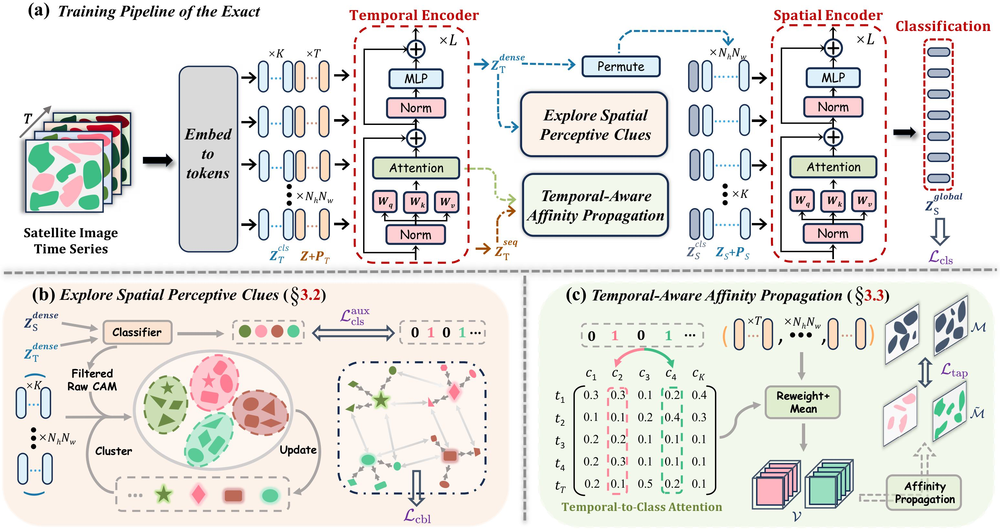

# [CVPR 2025 Highlight ✨] *Exact*: Exploring Space-Time Perceptive Clues for Weakly Supervised Satellite Image Time Series Semantic Segmentation [](https://arxiv.org/pdf/2412.03968)

This repository contains the source code of "*Exact*: Exploring Space-Time Perceptive Clues for Weakly Supervised Satellite Image Time Series Semantic Segmentation".

<br>
  
</div>


## :white_check_mark:Updates

* **`Jun. 3th, 2025`**:  The implementation code has been released.


## Get Started

### Environment

- Ubuntu 20.04, with Python 3.8.0, PyTorch 1.12.0, CUDA 11.6, multi gpus(8) - Nvidia RTX 3090.
- You can install all dependencies with the provided requirements file.

```bash
pip install -r requirements.txt
```

### Data Preparations

<details>
<summary>
PASTIS dataset
</summary>

The original PASTIS dataset is accessible [here](https://github.com/VSainteuf/pastis-benchmark). We follow the [TSViT](https://github.com/michaeltrs/DeepSatModels/blob/main/README_TSVIT.md) to divide each sample into 24x24 patches by running the script:

```bash
python data/PASTIS24/data2windows.py --rootdir <...> --savedir <...> --HWout 24
```

The reorganized directory should be:

```
PASTIS
├── pickle24x24
│   ├── 40562_9.pickle
│   └── ...
├── fold-paths
│   ├── fold_1_paths.csv
│   └── ...
```

In addition, we generate multi-class labels for each patch by running the following script:

```bash
python data/PASTIS24/seg2cls_label.py --pickle_path <...>/PASTIS/pickle24x24 
```

</details>

<details>
<summary>
Germany dataset
</summary>


The original Germany dataset is accessible [here](https://github.com/MarcCoru/MTLCC), we can download the dataset (40GB) via:

```bash
wget https://zenodo.org/record/5712933/files/data_IJGI18.zip
```

The size of each sample in Germany dataset is 24x24, so we only need to generate the multi-class labels with the above script without splitting. 

</details>

## Usage
```bash
bash run.sh $workspace $dataset_path
```


## Citation

Please cite our work if you find it helpful to your research.

```bibtex
@misc{zhu2025exact,
      title={Exact: Exploring Space-Time Perceptive Clues for Weakly Supervised Satellite Image Time Series Semantic Segmentation}, 
      author={Hao Zhu and Yan Zhu and Jiayu Xiao and Tianxiang Xiao and Yike Ma and Yucheng Zhang and Feng Dai},
      year={2024},
      eprint={2412.03968},
      archivePrefix={arXiv},
      primaryClass={cs.CV}
}
```


## Acknowledgement

This repo is built upon [TSViT](https://github.com/michaeltrs/DeepSatModels) and [PASTIS](https://github.com/VSainteuf/pastis-benchmark), thanks for their excellent works!

